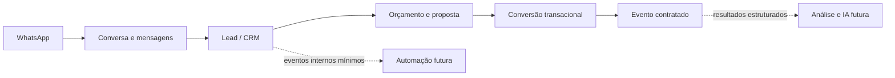

# Adendo de plano — Evolução comercial do CRM

## Estado atual relevante

O CRM já possui leads com origem, tipo e data desejada do evento, convidados, responsável, status, observações e histórico; orçamentos vinculados ao lead; e conversão transacional de orçamento aprovado em `contracted_event`. O evento preserva os vínculos ao lead e ao orçamento, portanto “ganho” já não é o fim físico do registro.

O atendimento é separado em `conversations` e `conversation_messages`. A fundação da integração oficial do WhatsApp já prevê conexão, webhook assinado e idempotente, mensagens de entrada/saída e origem de mensagem. O histórico comercial ainda é distribuído entre mensagens, `lead_history`, histórico de orçamento e histórico de evento.

## Mapa enxuto de dependências

O WhatsApp é responsável por transportar mensagens; conversa/mensagem registra o atendimento; o CRM decide dados e estágio comercial; orçamento e evento mantêm seus próprios domínios. Não criar agora fila, barramento, motor de workflow ou camada de IA.

## O que fazer agora

### [MVP AGORA] Concluir a integração de atendimento pelo WhatsApp sem acoplamento comercial

- Associar cada mensagem recebida/enviada à conversa e ao lead corretos, mantendo direção, origem, data, identificador externo e estado de entrega.
- Garantir que entrada, resposta humana e mudança de atendimento apareçam no histórico já existente.
- Manter webhooks idempotentes e isolar a API da Meta na camada de WhatsApp; regras de funil, responsável e próxima ação não devem viver no handler do webhook.
- Validar conexão/configuração com a Meta, texto humano, falhas de envio e ausência de duplicação antes do go-live.

### [MVP AGORA] Completar o acompanhamento manual mínimo do lead

- Adicionar campos opcionais de `next_action`, `next_action_at` e responsável pela ação, com criação e edição manual.
- Exibir e filtrar “follow-up vencido” e “próxima ação” no CRM, sem sequências automáticas, scoring ou recomendações.
- Registrar criação, edição e conclusão/reagendamento da ação na timeline do lead.
- Preservar a criação de lead com poucos campos: pacote de interesse, faixa de orçamento e data desejada continuam opcionais.

### [MVP AGORA] Consolidar a leitura da timeline sem reescrever históricos

- Criar uma leitura cronológica do relacionamento que combine, na interface/consulta, mensagens, `lead_history`, mudanças de status e referências a orçamento/proposta/evento.
- Manter as tabelas de domínio atuais como fonte de verdade; não migrar todo o histórico para uma tabela genérica.

## O que preparar agora

### [PREPARAR AGORA — prioridade] Metadados estruturados e nulos no lead

- Acrescentar apenas os campos baratos e opcionais que faltarem para `package_interest`, `budget_range`, `last_contact_at`, `next_action`, `next_action_at` e responsável da ação.
- Atualizar `last_contact_at` a partir de mensagem ou interação comercial relevante. O valor é um índice de consulta, não substitui a data original da mensagem.
- Indexar a consulta de responsáveis e próxima ação para a fila manual; validar a escrita no servidor e em RLS.

### [PREPARAR AGORA] Semântica de funil sem quebrar status existentes

- Preservar os estados atuais (`novo`, `em_atendimento`, `qualificado`, `orcamento_em_elaboracao`, `proposta_enviada`, `negociacao`, `ganho`, `perdido`).
- Expor uma classificação conceitual derivada: **ativo** para os estados em andamento, **acompanhamento/nutrição** para leads pausados com próxima ação futura, **perdido** para `perdido` e **convertido** quando houver evento contratado ligado ao lead. Não introduzir uma migração de enum apenas para renomear o funil.

### [PREPARAR AGORA] Contrato mínimo de eventos internos

- Centralizar nomes e payloads mínimos documentados para `lead.created`, `lead.updated`, `lead.status_changed`, `message.received`, `message.sent`, `proposal.sent` e `lead.converted`.
- Inicialmente, cada ação continua gravando seus históricos transacionais atuais. Não publicar fila, webhooks internos nem processador assíncrono.
- Ao adicionar a próxima ação, prever também `follow_up.created`, `follow_up.completed` e `follow_up.rescheduled` somente como vocabulário/documentação até haver necessidade real de automação.

### [PREPARAR AGORA] Conversão e dados para aprendizado futuro

- Manter `contracted_events.lead_id` e `quote_id` como fonte do vínculo Lead → Evento; a aprovação atômica já reduz risco de conversão parcial.
- Passar a registrar origem, estágio, responsável, datas de interação, proposta e resultado de forma estruturada. Isto permite análises futuras sem coletar conteúdo excessivo ou introduzir IA agora.

## Backlog explícito

- [BACKLOG] Follow-ups automáticos, interrupção de sequências após resposta e nutrição segmentada.
- [BACKLOG] Agenda comercial de visita, reunião e degustação, com lembretes ao cliente e à equipe.
- [BACKLOG] Lead scoring determinístico (`quente`, `morno`, `nutrição`, `não qualificado`); qualquer complemento por IA fica posterior.
- [BACKLOG] Workflow completo após conversão: contrato, sinal, planejamento, fornecedores, execução, gatilhos de 30/15/7/2 dias, dia do evento e pós-evento.
- [BACKLOG] Pós-evento: agradecimento, avaliação/NPS, fotos/autorização, indicação e relacionamento recorrente.
- [IA FUTURA] Next Best Action, análise de conversão/perdas, previsão de fechamento/faturamento e identificação de padrões comerciais. Só iniciar após dados estruturados suficientes e revisão de privacidade.

## Riscos de overengineering a evitar

- Criar motor de automação, scheduler, filas ou event bus antes de existir mais de um consumidor real dos eventos.
- Trocar os status atuais por um funil inteiramente novo em vez de adicionar a camada conceitual derivada.
- Duplicar mensagens em uma nova timeline física quando as tabelas de origem e suas auditorias já existem.
- Inserir IA na triagem, pontuação ou recomendação antes de ter dados confiáveis, transparência e controle humano.

## Ordem recomendada

1. [MVP AGORA — em andamento] Concluir e validar o caminho WhatsApp → conversa/mensagem → lead/histórico.
2. [MVP AGORA — paralelo aprovado] Implementar próxima ação manual, responsável e fila de follow-up vencido, sem depender do go-live do WhatsApp.
3. [PREPARAR AGORA] Depois, acrescentar campos opcionais, `last_contact_at`, índices e vocabulário de eventos internos.
4. [MVP AGORA] Em seguida, disponibilizar a timeline consolidada e a classificação conceitual do funil, aproveitando mensagens quando a integração as disponibilizar.
5. [BACKLOG] Priorizar automação, agenda, scoring, pós-evento e IA somente conforme uso e dados disponíveis.
